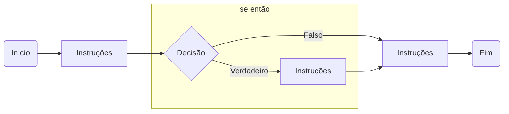
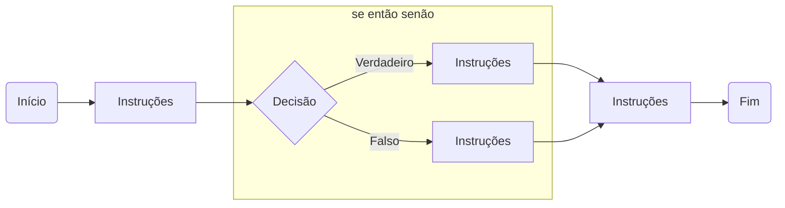
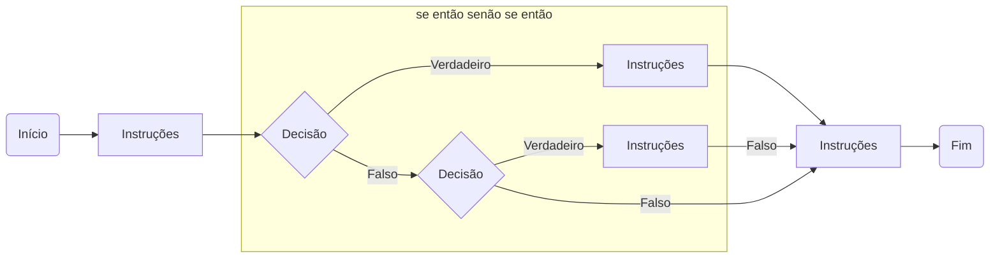
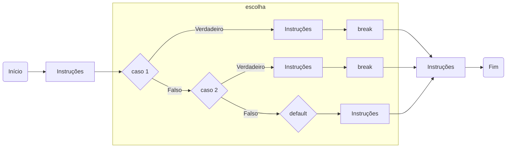
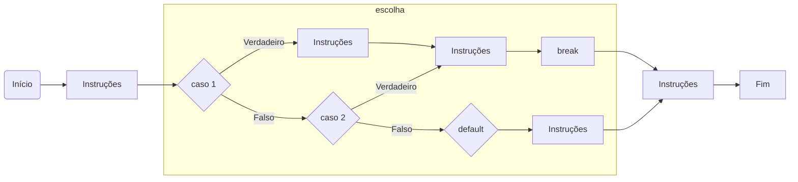

# Saída de dados
## Método System.out.println :
```java A instrução
A instrução System.out.println(), gera uma saída de texto entre aspas duplas significando uma String, criando uma nova
linha e posicionando o cursor na linha abaixo, o que é identificado pela terminação "ln". Veja no exemplo abaixo
```
```java
public class Main {
    public static void main(String[] args) {
        System.out.println("Aqui vai o seu texto para ser demonstrado no console/terminal");
    }
}
```
## Método System.out.print :
```
O método print, se for observado não possui o 'ln', por isso exibe uma string sem criar uma nova linha, deixando assim 
seu cursor na mesma linha.
```
```java
public class Main {
    public static void main(String[] args) throws Exception {
        System.out.print("Leandro ");
        System.out.print("Barbosa");
    }
}
```
## Exibir o valor de uma variável :
```java
public class Main {
    public static void main(String[] args) throws Exception {
        int variavel1 = 1;
        int variavel2 = 2;
        int variavel3 = 3;
        String nome = "Luana";
        
        System.out.println(variavel1);
        System.out.println(variavel2);
        System.out.println(variavel3);
        System.out.println(nome + "!!");
    }
}
```
## Exibir o valor de um decimal :
```java
public class Main {
    public static void main(String[] args) throws Exception {
        float decimal1 = 10.4f;
        float decimal2 = 23.99f;

        System.out.println("Primeira decimal: " + decimal1);
        System.out.println("Segunda decimal: " + decimal2);
    }
}
```
# Classe Math
## Definição :
```java
A classe Java Math tem muitos métodos que permitem realizar tarefas matemáticas em números.
Serve para que possamos trabalhar mais facilmente com operações matemáticas não tão elementares como pequenas funções aritméticas
```
## Principais operações :
```java
Math.abs
Math.acos
Math.asin
Math.atan
Math.ceil
Math.cos
Math.exp
Math.floor
Math.log
Math.max
Math.min
Math.pow
Math.random();
Math.round
Math.sin
Math.sqrt
Math.tan
Math.toDregrees
Math.toRadians

A classe Math também possui 2 campos finais estáticos (constantes), são eles:

Math.E : que é a constante para bases naturais de logs.
Math.PI : constante do valor PI.
```
# String
## Concatenação de String
```java
Para concatenar duas string, usa-se o método concat. Note que, já que o tamanho de uma String não pode mudar, a concatenação 
resulta na criação de um novo objeto


public class App {
    public static void main(String[] args) {
        System.out.println();
        String str1 = "Boa ";
        String str2 = "Noite";

        System.out.println();
        System.out.println(str1.concat(str2));
        System.out.println();
    }
}
```
## Principais operações sobre String
## Comparação de String
```java
import java.util.Scanner;

public class App {
    public static void main (String[] args) {
        Scanner leitor = new Scanner(System.in);
        System.out.println("");
        System.out.println("Digite algo");
        String a = leitor.nextLine();
        System.out.println("");
        System.out.println("Digite outra coisa para comparar");
        String b = leitor.nextLine();

        //System.out.println(teste1.equalsIgnoreCase(teste3));
        //System.out.println(teste2.equalsIgnoreCase(teste1));

        if (a.equalsIgnoreCase(b)) {
            System.out.println("");
            System.out.println("É igual");
            System.out.println("");
        } else {
            System.out.println("");
            System.out.println("É diferente");
            System.out.println("");
        } 
    }
}
```
## Diferença entre String e caracter
```java
Char é um tipo de dados primitivo usado para conter um único caractere. Significa um único caractere do conjunto de 
caractere do conjunto de caracteres UTF-16. Em comparação, String é um classe que contém uma sequência de caracteres
e pode ser considerada uma matriz de caracteres.
Um char pode ser convertido implicitamente em ushort, int, uint, long, float, ulong, double ou decimal, o tipo string
representa uma sequencia de zero ou mais caracteres Unicode.
```
# Entrada de Dados
## Classe Scanner

Ela possui a finalidade de separar a entrada a entrada dos textos em blocos. Deste modo, permite a criação dos tokens. Eles são
sequências de caracteres que são separados por delimitadores. O padrão destes delimitadores é definido em tabulações, espaços em
branco e em mudanças de linhas.

### Obter um valor inteiro :
```java
import java.util.Scanner;

public class Main {
    public static void main(String[] args) throws Exception {
        //Lógica
        System.out.println("");
        Scanner leitor = new Scanner(System.in);
        System.out.println("Digite um numero inteiro:");
        int numero1 = leitor.nextInt();
        System.out.println("Digite o segundo numero inteiro:");
        int numero2 = leitor.nextInt();
        int numero3 = numero1 * numero2;
        int numero4 = numero1 + numero2;
        //Mensagens em tela demonstrando os resultados
        System.out.println("");
        System.out.println("Os valores digitados multiplicados entre si: " + numero3);
        System.out.println("Os valores digitados somados entre si: " + numero4);
        System.out.println("");
    }
}
```
### Obter um valor decimal :
```java
import java.util.Scanner;

public class Main {
    public static void main(String[] args) throws Exception {
        //Lógica
        System.out.println("");
        Scanner leitor = new Scanner(System.in);
        System.out.println("Digite um numero decimal:");
        float numero1 = leitor.nextFloat();
        System.out.println("Digite o segundo numero decimal:");
        float numero2 = leitor.nextFloat();
        float numero3 = numero1 * numero2;
        float numero4 = numero1 + numero2;
        //Mensagens em tela demonstrando os resultados
        System.out.println("");
        System.out.println("Os valores digitados multiplicados entre si: " + numero3);
        System.out.println("Os valores digitados somados entre si: " + numero4);
        System.out.println("");
    }
}
```
### Obter um valor de texto :
```java
import java.util.Scanner;

public class Main {
    public static void main (String[] args) {
        Scanner leitor = new Scanner(System.in);
        System.out.println("");
        System.out.println("Digite algo");
        String a = leitor.nextLine();
        System.out.println("");
        System.out.println("Digite outra coisa para comparar");
        String b = leitor.nextLine();

        if (a.equalsIgnoreCase(b)) {
            System.out.println("");
            System.out.println("É igual");
            System.out.println("");
        } else {
            System.out.println("");
            System.out.println("É diferente");
            System.out.println("");
        } 
    }
}
```
# Fluxo de Controle
## Estruturas de Decisões
### if-else-then



``` java
instruções;
if(DECISAO){
  instruções;
}
instruções;
```



``` java
instruções;
if(DECISAO){
  instruções;
}else{
  instruções;
}
instruções;
```



``` java
instruções;
if(DECISAO){
  instruções;
}else if(DECISAO){
  instruções;
}
instruções;
```

### switch

``` java
instruções;
switch(VARIAVEL){
  case 1:
      instruções;
      break;
  case 2:
      instruções;
      break;
  default
      instruções;
}
instruções;
```

``` java
instruções;
switch(VARIAVEL){
  case 1:
      instruções;
  case 2:
      instruções;
      break;
  default
      instruções;
}
instruções;
```


## Estruturas de Repetições
### for :
```java
É uma estrutura de repetição compacta. Seus elementos de inicialização, condição e iteração são reunidos na forma de um cabeçalho
e o corpo é disposto em seguida.
Observe que a inicialização, condição e iteração aparecem, entre parênteses, após  a palavra reservada "for" e elas são separadas
apenas por um ponto e vírgula. A instrução ou bloco de instruções que este tipo de laço repete são transcritos a partir da linha 
subsequente ao seus cabeçalho.

for(inicialização; condição; alteração da variável){
//comando
}

import java.util.Scanner;

public class Main {
    public static void main(String[] args) throws Exception {
        Scanner leitor = new Scanner(System.in);
        System.out.println("");
        System.out.println("Digite o numero que gostaria de saber a tabuada: ");
        int tabuada = leitor.nextInt();
        System.out.println("");
        int cont = 0;
        
        for (;cont <= 10; cont ++) {
            int resultado = tabuada * cont;
            System.out.println(tabuada + " x " + cont + " = " + resultado);
        }
        System.out.println("");
    }
}
```
### while :
```java
O termo while pode ser traduzido para o português como "enquanto". Este termo é utilizado para construir uma estrutura de 
repetição que executa repetidamente, um única instrução ou um bloco delas "equanto uma expresão booleana for verdadeira"

import java.util.Scanner;
public class Main {
    public static void main(String[] args) {
        Scanner leitor = new Scanner(System.in);
        System.out.println("");
        System.out.println("Digite um valor menor que 10 para somar:");
        int num1 = leitor.nextInt();
        System.out.println("");

        if (num1 <= 9) {
            while (num1 <= 9) {
                num1 ++;
                System.out.println(num1);
            }
        System.out.println("");
        } else if (num1 == 10) {
            System.out.println("");
            System.out.println("É igual");
            System.out.println("");
        } else {
            System.out.println("");
            System.out.println("Valor fora do permitido");
            System.out.println("");
        }
    }
}
```
### do-while :
```java
A estrutura de repetição do-while é uma variação da estrutura while, existe uma diferença sutil, porém importante entre elas.
Em um laço while, a condição é testada antes da primeira execução das instruções que compõem seu corpo. Desse modo, se a condição 
for falsa na primeira vez em que for avaliada, as instruções desse laço não serão executadas nenhuma vez. Em um laço do-while
,por outro lado, a condição somente é avaliada depois que suas instruções são executadas pela primeira vez, assim, mesmo que a
condição desse laço seja falsa antes de ele iniciar, suas instruções serão executadas pelo menos uma vez.

Exemplo de um tabuada sem while ou for apenas utilizando o do-while.

import java.util.Scanner;
public class Main {
    public static void main(String[] args) {
        Scanner leitor = new Scanner(System.in);
        int oi;
        do {
            System.out.println("");
            System.out.println("Digite a tabuada que deseja saber");
            int tabuada = leitor.nextInt();
            int opcao = tabuada * 0;
            int opcao1 = tabuada * 1;
            int opcao2 = tabuada * 2;
            int opcao3 = tabuada * 3;
            int opcao4 = tabuada * 4;
            int opcao5 = tabuada * 5;
            int opcao6 = tabuada * 6;
            int opcao7 = tabuada * 7;
            int opcao8 = tabuada * 8;
            int opcao9 = tabuada * 9;
            int opcao10 = tabuada * 10;
            System.out.println("");
            System.out.println(tabuada + " x " + "0" + " = " + opcao);
            System.out.println(tabuada + " x " + "1" + " = " + opcao1);
            System.out.println(tabuada + " x " + "2" + " = " + opcao2);
            System.out.println(tabuada + " x " + "3" + " = " + opcao3);
            System.out.println(tabuada + " x " + "4" + " = " + opcao4);
            System.out.println(tabuada + " x " + "5" + " = " + opcao5);
            System.out.println(tabuada + " x " + "6" + " = " + opcao6);
            System.out.println(tabuada + " x " + "7" + " = " + opcao7);
            System.out.println(tabuada + " x " + "8" + " = " + opcao8);
            System.out.println(tabuada + " x " + "9" + " = " + opcao9);
            System.out.println(tabuada + " x " + "10" + " = " + opcao10);
            System.out.println("");
            System.out.println("Digite 1 para continuar ou 2 para sair do programa");
            oi = leitor.nextInt();
        } while (oi == 1);
        if (oi == 2) {
            System.out.println("");
            System.out.println("Saindo...");
            System.out.println("Programa fechado com sucesso.");
        }
    }
}
```
### Comandos break e continue
break: O comando break é usado em laços de repetições while, do/while, for e com os comandos switch/case. Quando usado em laço
de repetição, causa uma interrupção imediata do mesmo, continuando a execução do programa na próxima linha após o laço, isso ocorre
caso a condição imposta seja atendida.
```java
import java.util.Scanner;
public class App {
    //break dentro de um switch dentro de uma repetição
    public static void main(String[] args) {
        Scanner leitor = new Scanner(System.in);
        System.out.println();
        System.out.println("Digite um valor menor que 10: ");
        int num1 = leitor.nextInt();
        //do variavel
        int a = 0;
        //
        do {
            switch (num1) {
                case 1 :
                    System.out.println();
                    System.out.println("Você digitou 1 !!");
                    System.out.println();
                    break;
                case 2 :
                    System.out.println();
                    System.out.println("Você digitou 2 !!");
                    System.out.println();
                    break;
                    case 3 :
                    System.out.println();
                    System.out.println("Você digitou 3 !!");
                    System.out.println();
                    break;
                case 4 :
                    System.out.println();
                    System.out.println("Você digitou 4 !!");
                    System.out.println();
                    break;
                case 5 :
                    System.out.println();
                    System.out.println("Você digitou 5 !!");
                    System.out.println();
                    break;
                case 6 :
                    System.out.println();
                    System.out.println("Você digitou 6 !!");
                    System.out.println();
                    break;
                case 7 :
                    System.out.println();
                    System.out.println("Você digitou 7 !!");
                    System.out.println();
                    break;
                case 8 :
                    System.out.println();
                    System.out.println("Você digitou 8 !!");
                    System.out.println();
                    break;
                case 9 :
                    System.out.println();
                    System.out.println("Você digitou 9 !!");
                    System.out.println();
                    break;
                case 10:
                    System.out.println();
                    System.out.println("Você digitou 10 !! ");
                    System.out.println();
                    break;
                default:
                    System.out.println();
                    System.out.println("Você digitou um valor fora do range proposto !! ");
                    System.out.println();   
                    System.out.println("Digite 1 para continuar ou 2 para sair do programa: ");
                    a = leitor.nextInt();
                    break;
            } 
        } while (a == 1);
        if (a == 2) {
            System.out.println();
            System.out.println("Encerrando...");
            System.out.println();
        }
    }
}
```
continue: O continue interrompe uma iteração (loop), se ocorrer uma condição especificada, e continua com a próxima iteração no loop.

```java
public class App {
    public static void main(String[] args) {
        //mostrando o continue dentro de uma repetição
        System.out.println();
        for (int num1 = 0 ; num1 <= 10 ; num1++) {
            if (num1 == 4) {
                System.out.println("numero 4");
                continue;
            }
            System.out.println(num1);
        }
        System.out.println();
    }
}
```
# Arranjos e Matrizes
## Definição matemática
```java
Os arrays ou matrizes, como são conhecidos pelo Java, fazem parte do pacote java.util na coleção da API do Java. São
objetos de recipientes que contém um número fixo de valores de um único tipo. O comprimento de um array é estabelecido quando
criado, sendo que após a criação o seu comprimento fica fixo.
Na programação Matrizes, Vetores e Arranjos são definidos como conjunto de valores ordenados, 
que podem ser acessados por sua devida possição neste conjunto ordenado.
Cada item em um array é chamado de elemento, e cada elemento é acessado pelo número, o índice. Abaixo é mostrado
se dá esse acesso aos seus elementos lembrando que sempre sua numeração começa em 0.

[10, 20, 30, 40, 50]
 0   1   2    3   4
```
## Declaração de arranjos
```java
import java.util.Arrays;
public class App {
    public static void main(String[] args) {
        int vetor [] = {1,2,3,4,5,6,7,8,9,10,11,12,13,14,15};
        System.out.println();
        System.out.println(Arrays.toString(vetor));
        System.out.println();
    }
}
```
## Declaração de matrizes
```java
Uma matriz é um vetor de vetores, todos de mesmo tamanho. É possível criar um vetor de vetores onde cada elemento tem
um tamanho diferente. Nesse caso, cada elemento deve ser criado de forma independente. Todo vetor em Java tem atributo
length que define o seu número de elementos.
```
## Percorrer arranjos
```java
//percorrer arranjo
import java.util.Arrays;
public class App {
    public static void main(String[] args) {

        int vetor [] = {1,2,3,4,5,6,7,8,9,10,11,12,13,14,15};
        
        System.out.println();
        for (int i = 0; i < vetor.length; i++)
        System.out.println(vetor[i] + "");
        System.out.println();
    }
}
```
## Percorrer matrizes
### Linha a linha
```java
//matrizes
import java.util.Arrays;
public class App3 {
    public static void main(String[] args) {
        //percorrer matriz de 2 linhas e 3 colunas
        //matriz desenhada abaixo

        // x | x | x
        // y | y | y

        int qtdLinhas = 2;
        int qtdcolunas = 3;

        int matriz [] [] = new int [qtdLinhas] [qtdcolunas];

        for (int linha = 0; linha < qtdLinhas; linha++) {

            for (int coluna = 0; coluna < qtdcolunas; coluna++) {

                matriz[linha][coluna] = 1;

            }
        }
    System.out.println(matriz[0][0]);
    System.out.println(matriz[0][1]);
    System.out.println(matriz[0][2]);
    System.out.println(matriz[1][0]);
    System.out.println(matriz[1][1]);
    System.out.println(matriz[1][2]);
    }
}
```
### Coluna a coluna
```java
int[][] matriz = new int[3][3];
for (int b = 0; b < matriz[0].length; b++) {
    for (int a = 0; a < matriz.length; a++) {
    System.out.println(matriz[j][b]);
    }
}
```
### Em diagonal
```java
int [][] dgl = new int [3][3];
for (int a = 0; a < dgl.length; a++) {
    for (int b = 0; b < dgl[a].length; b++) {
    if (a == b) {
        System.out.println(dgl[a][b]);
    }
    }
}
```
## Utilizar arranjos e matrizes como parâmetros de métodos
```java
public class App {
    public static void addArrays(int[] a, int[] b) throws Exception { 
        for(int c = 0; i < a.length; c++) {
            int sum = a[c] + b[c];
            System.out.primtln();
            System.out.print(sum + " ");
            System.out.println();
        }
    }
}
```
## Utilizar arranjos e matrizes como retorno de métodos
```java
public class App {
    public static void main(String[] args) throws Exception {
        int[] t1 = {1, 2, 3, 4, 5};
        int[] t2 = {2, 4, 6, 8, 10};
        addArrays(t1, t2);
    }
}
```
# Tratamento de Exceções
## Definição
```java
As exceções ocorrem quando algo imprevisto acontece, elas podem ser provenientes de erros de lógica ou acesso a
recursos que talvez não estejam disponíveis.
```
## Exceções comuns
```java
O uso de exceções em um sistema é de extrema importância, pois ajuda a detectar e tratar possíveis erros que
possam acontecer. Entretanto, na linguagem Java existem dois tipos de exceções, que são:

Implícitas: Exceções que não precisam de tratamento e demonstram serem contornáveis. Esse tipo origina-se da
subclasse "Error" ou RunTimeException.

Explícitas: Exceções que precisam ser tratadas e que apresentam condições incontornáveis. Esse tipo origina
do modelo throw e necessita ser declarado pelos métodos. É originado da subclasse "Exception" ou "IOException".
```
### Divisão por zero
```java
public class App {
    public static void main(String[] args) {
        int a = 10;
        int b = 0;

        try{
            System.out.println(a / b);
        }
        catch (ArithmeticException e) {
            System.out.println();
            System.out.println("Não é possível dividir por zero");
            System.out.println();
        }
    }
}
```
### Conversão de tipos de dados inválidos
```java
public class App {
        public static void main(String[] args) {
                System.out.println();

                int a = 10;
                String text;

                try {
                        b = text = a;
                } catch (Exception e) {
                        System.out.println();
                        System.out.println("Não é possível converter tipos de dados diferentes");
                        System.out.println();
                }
        }
}
```
### Acessar uma posição inválida em um arranjo
```java
public class App {
    public static void main(String[] args) {
        System.out.println("Acessando posicao nula");

        int[] g = new int[5];
        int h = a[5];
    }
}
```
### Acessar uma String nula
```java
public class App {
    public static void main(String[] args) {
        System.out.println("Acessando string nula");

        String t = null;
        int s = t.length();
    }
}
```
## Bloco para capturar uma exceção
```java
public class App {
        public static void main(String[] args) {
                System.out.println();
                System.out.println("Exceção básica matematica:");
                try{ 
                        int num1 = 100;
                        int num2 = 0;
                        int num3 = num1 / num2;
                }
                catch(ArithmeticException e) {
                        System.out.println();
                        System.out.println("Ops, a divisão não é possivel por conter um 0");
                        System.out.println();
                }
        }
}
```
## Bloco para capturar diferentes exceções
```java
public class App {
        public static void main(String[] args) {
                try {
                        int g = 10;
                        int h = 0;
                        int u = g / h;
                } catch (ArithmeticException e) {
                        System.out.println();
                        System.out.println("Impossivel realizar a divisão por 0");
                        System.out.println();
                } catch (Exception e) {
                        System.out.println();
                        System.out.println("Erro ocorre pois: " + e.getMessage()); //o getMessage trará a mensagem de erro da Exceção   
                        System.out.println();
                }
        }
} 
```
## Bloco finally
```java
O bloco finally é utilizado para garantir que um código seja executado após um try, mesmo que uma exceção tenha sido
gerada. Mesmo que tenha um return no try ou no catch, lembrando que o bloco finally sempre é executado.
```
```java
public class App {
        public static void main(String[] args) {
                System.out.println();

                try{
                        int f = 0;
                        int g = 0;
                        int h = f/g;
                }
                catch (Exception e) { 
                        System.out.println("Isso não é possível");
                }
                finally {
                        System.out.println("Caiu no finally");
                }
        }
}
```
## Lançar uma exceção
```java
public class App{
        public static void main(String[] args) {
                System.out.println("Exceção aritmética de divisão padrão");
                try{
                        int num1 = 8;
                        int num2 = 0;
                        if (num1 > 0) {
                                if (num2 == 0) {
                                        System.out.println();
                                        throw new ArithmeticException("Ops, divisão por zero...");
                                }
                        }
                }
                catch(Exception e) {
                        System.out.println();
                        System.out.println("Erro java: " + e.getMessage()); //Printará o erro da exceção
                        System.out.println();
                }
        }
}
```
# Métodos estáticos
## Estrutura de declaração de um método estático
```java
    Os métodos static ou métodos da classe são funções que não dependem de nenhuma variável de instância, quando invocados
executam uma função sem a dependência do conteúdo de um objeto ou a execução da instância de uma classe, conseguindo
chamar direto qualquer método da classe e também manipulando alguns campos da classe.
    Os métodos static tem um relacionamento com uma classe como um todo, enquanto os métodos que não são static são associ
ados a uma instância de classe específica(objeto) e podem manipular as variáveis de instância do objeto, como pode ser
visto nos exemplos de declarações de métodos.
```
```java
public class Main {
    public static void main(String[] args) {
        int a = 1;
        int b = 2;

        System.out.println("Valor de a: " + a);
        System.out.println("Valor de b: " + b);
    }
}
```
## Nomes válidos e boas práticas
```java
Alguns exemplos de boas práticas
1. Nomear variáveis e métodos de forma descritiva
2.  Evite código “Hadouken”. Simplifique-o
3. Use nomes específicos para cada variável, “valor”, “igual”, “dados” não são nomes validos para nenhum caso
4. Use nomes “significativos” para as variáveis. Através do nome da variável você deve ser capaz de saber o que ela contém.
5. Não inicie nomes de variáveis com o_, obj_, m_, etc.
6. Não reuse o mesmo nome de variável na mesma classe em diferentes contextos.
7. Não use o mesmo nome de variável para diferentes propósitos em um método ou condicional.
8. Não use caracteres não-ASCII em nomes de variáveis.
9. Decida pelo uso de uma linguagem natural apenas: ou seja, só português ou só inglês.
10. Use nomes significativos para os parâmetros dos métodos, dessa forma eles podem ser auto-explicativos sem a 
necessidade de uma documentação explicativa adicional.
```
## Parâmetros
```java
import java.util.Scanner;

public class App {
    public static void main(String[] args) {
        Scanner leitor = new Scanner(System.in);
        System.out.println();
        System.out.println("Digite um numero");
        float f = leitor.nextFloat();

        System.out.println();
        System.out.println("Numero digitado: " + f);
        System.out.println();
    }
}
```
## Retorno
```java
Quando se chega a uma declaração "return" a função é encerrada imediatamente e, se o valor de retorno é informado, a função retorna este valor.
```
## Utilização de métodos estáticos
```java
public class App {
    public static void main(String[] args) {
        System.out.println("Método static");
    }
}
```
### Disponíveis na mesma classe
```java
public class App {
    public static void main(String[] args) {
        System.out.println("Método static na mesma classe");
    }
}
```
### Disponíveis em outra classe/arquivo.
```java
 class classe1 { 
    static String nome;
    static String getNome() {return Nome; }
```
## Recursão
# Classe
## Definição
```java
Uma classe é um elemento do código Java que utilizamos para representar objetos do mundo real. Dentro dela é comum declararmos
atributos e métodos que representam, respectivamente, as características e comportamentos desse objeto.
```
### Representação de classe e objeto na UML

### Diferença entre classe e objeto
```java
Resumidamente uma classe é a representação de um conjunto de objetos ja os objetos são as instancias/elemtentos da classe.
```
## Atributos
```java
São representadas por variaveis que se referem aos objetos
```
## Métodos
```java
Servem para a comunicação entre os objetos.
```
## Construtor
```java
Responsável por alocar o objeto na memória
```
## Objeto
```java
Uma entidade que possui estado e comportamento é conhecida como um objeto, por exemplo, cadeira, bicicleta, marcador,
caneta, mesa, carro
```
## Inicialização de um objeto
```java
Podem ser chamados por métodos e construtores.
```
## Utilização de um objeto
```java
É utilizado a partir do operador new, "new Nome()".
```
## Comparação de objetos
```java
A comparação de objetos é feita a partir do operador equal().
```
## Método toString
```java
O método toString retorna uma representação string de um objeto.

leao.toString();

```
## Visibilidade de atributos e métodos
### Público
```java
public: Disponível para todos no mesmo pacote.
```
### Privado
```java
private: Apenas a própria classe possui o acesso.
```
## Sobrecarga de métodos
```java
A sobrecarga de métodos (overload) é um conceito do polimorfismo que consiste basicamente em criar variações de um mesmo método
ou seja, a criação de dois ou mais métodos com nomes totalmente iguais em uma classe.
```
## Sobrecarga de construtores
```java
Quando colocamos diversas versões do construtor dentro de uma classe, estamos fazendo uma sobrecarga de construtores.
```
# Pacotes
## Definição
```java
Um pacote ou package nada mais é do que um conjunto de classes localizadas na mesma estrutura hierárquica de diretórios.
```
### Representação de pacotes na UML

## Definição de um pacote em uma classe
```java

package animais;
public class leao {
}

```
## Importando uma classe de um pacote diferente
```java

import animais.Zebra;

public class animais {

}

```
## Visibilidade de classes, atributos e métodos
### Default/Pacote
```java
Quando definimos a visibilidade de uma classe, atributo ou método, ela vem como `package` por padrão.

class animais {
}
```
## Pacote default
```java
class animais {
}
```
# Escopo de classe e objeto
## Definição
```java
Escopo de uma variável é a parte do programa que pode acessar uma variável. Quando você tenta acessar uma variável que não está no escopo, você normalmente tém um erro do compilador.
```
### Palavra reservada static
´´´java
A palavra reservada static se refere para criação de métodos estáticos e variáveis estáticas. 
Métodos estáticos são métodos que podem ser chamados sem a necessidade de criar uma instância da classe.
Variáveis estáticas são variáveis que pertencem a classe e não a um objeto.
Quando você tenta acessar uma variável que não está no escopo, você normalmente tém um erro do compilador.
´´´
# Herança
## Definição
```java
A herança é um mecanismo da Orientação a Objeto que permite criar novas classes a partir de classes já existentes, aproveitando-se das características existentes na classe a ser estendida.
Geralmente é chamado de classe pai ou superclasse.
A classe que herda é chamada de classe filha ou subclasse.
```
### Representação de herança na UML

## Criação de uma classe que realiza herança
```java
É utilizado a função "extends".
public class Animais extends Mamíferos {
}
logo a classe filha irá herdar todos os atributos e métodos.
```
## Sobreescrita de métodos
```java
A sobreescrita de métodos é a capacidade de uma classe filha sobrescrever um método da classe pai.
```
## Polimorfismo
```java
O polimorfismo é a capacidade de uma variável de uma classe filha referenciar um objeto de uma classe filha ou de uma classe pai.
Para utilizar o polimorfismo, basta criar uma variável da classe filha e atribuir um objeto da classe filha ou da classe pai.
```
### Conversão de tipos
```java
A conversão de tipos é o ato de forçar uma expressão a utilizar e retornar um determinado tipo. Também chamamos esta modalidade de “Casting”.
```
## Visibilidade de atributos e métodos
### Protegido
## Palavra reservada super
### Encadeamento de construtor
### Encadeamento de método

# Interface
## Definição
```java
É um recurso muito utilizado em java, bem como na maioria das linguagens orientadas a objeto, para "obrigar" a um determinado
grupo de classes a ter métodos ou propriedades em comum para existir em um determinado contexto

```
### Representação de interface na UML

## Criação de uma classe que implementa uma interface
## Sobreescrita de métodos
## Polimorfismo
### Conversão de tipos

# Classe abstrada
## Definição
```java
É um tipo de classe especial que não pode ser instanciada, apenas herdada. Sendo assim, uma classe abstrata não pode ter um objeto
criado a partir de sua instanciação.
```
### Representação de classe abstrata na UML
```java

```
## Criação de uma classe que extende uma classe abstrata
```java
public class classe2 extends classe1 {
  // declaração de atributos
  // declaração de métodos
}
```
## Polimorfismo
```java
public class classe2 extends classe2 {
  //...
  //...
  @Override
  public void nmetodo1() {
    //...
  }
}
```
### Conversão de tipos
```java
public class main {
    public static void main (String args[]) {
        int a = 10;
        String binstr = Integer.toBinaryString(i);
    }
}
```
# Coleções
## Definição
## List e Arraylist
### Aplicações
### Declaração
### Utilização
#### Adicionar elementos
#### Acessar elementos
#### Atualizar elementos
#### Remover elementos
# Map e HashMap
## Aplicações
## Declaração
## Utilização
### Adicionar elementos
### Acessar elementos
### Atualizar elementos
### Remover elementos
# Tipo Enumerado
## Definição
### Representação de tipos enumerados na UML
# Representação de tempo
## Classe Date
## Classe Calendar
## API Date/Time Java 8
### LocalDate
### LocalTime
### LocalDateTime
### Period
### Duration
### Formação de Date/Time
# Modificador final
## Definição
### Representação de final no diagrama UML
## Modificador final em uma variável
### Variável de tipo primitivo
### Objeto
## Modificador final em um atributo
### Atributo primitivo
### Objeto
## Modificador final em um método
## Modificador final em uma classe
# Objeto imutável
## Definição
## Aplicações
## Como criar um objeto imutável
## Como modificar um objeto imutável
# Tipos Genéricos
## Definição
### Representação de tipos genéricos na UML
## Criação de classes com tipos genéricos
## Inicialização de objetos com tipos genéricos
# Testes Unitários
## TDD
## JUnit
### Adicionar JUnit no projeto Java
## Teste assertEquals
## Teste assertTrue/assertFalse
## Teste assertNull/assertNull
## Teste assertArrayEquals
## Teste fail
## Teste capturar uma exception
# JDBC
## Definição
## Driver de conexão
## Como adicionar o driver de conexão no projeto Java
## Criação de uma conexão com o banco de dados
### Classe DataManager
### String de conexão
#### Banco SQLite
#### Banco MySql
#### Banco Postgre
### Classe Connection
## Enviar instruções SQL
### Classe Statement 
### Classe PreparedStatment
## Consultar registros no banco de dados
### Classe ResultSet 
### Obter um registro
### Obter uma coleção de registros
## Bloco de instruções try-with-resources
## Captura de exceções
### Driver não encontrado
### Conexão inválida
### Tabela não encontrada
### Registro não encontrado
### Erro ao inserir/atualizar
### Erro ao consultar
## Design Patterns
### Singleton Factory para criação de conexões
#### Representação na UML
### DAO para manipular dados de uma tabela
## Representação na UML
